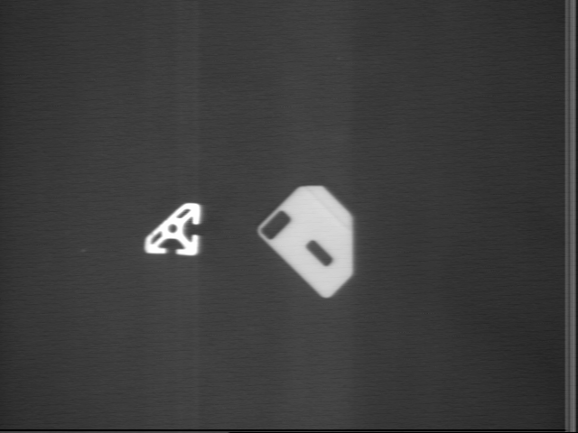
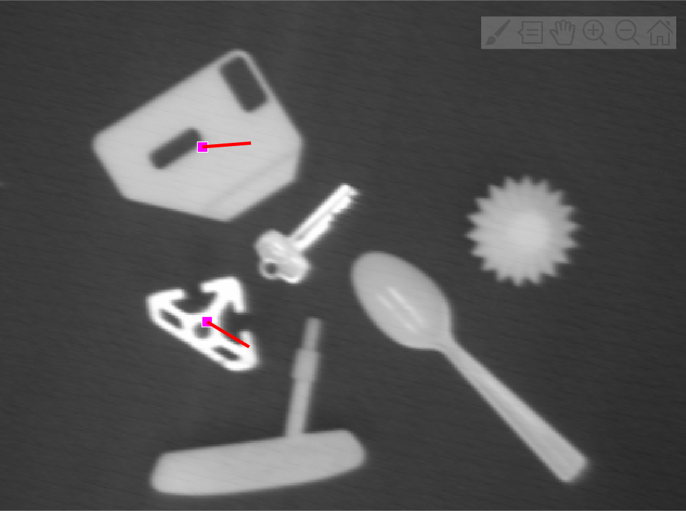
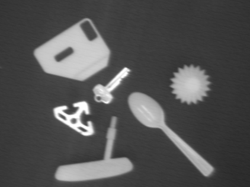
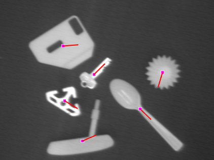
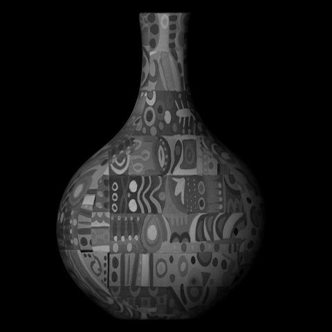
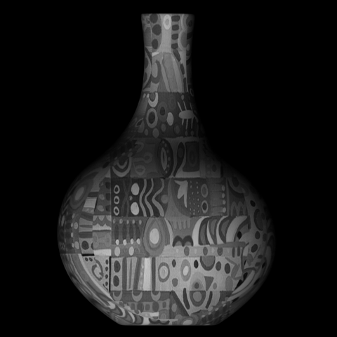
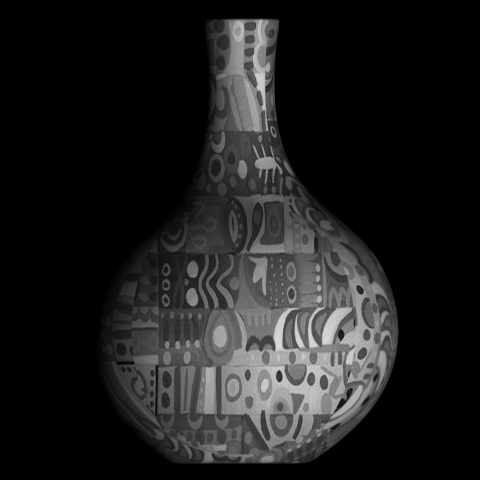
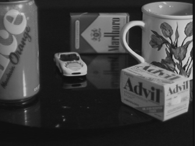
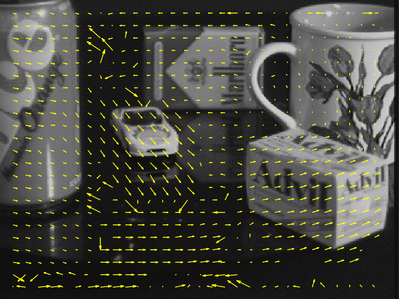

# UWMad-CS766

## Homework 1 - Getting started with MATLAB:
Goal of this homework is to learn how to create collages and how to superimpose images.

## Homework 2 - Object Detection:
Goal of this assignment is to build an object detection program which identifies simple planar geometric shapes using template matching.

Some results from this implementation are shown below, where left image has the source objects which are identified in right image:

	
	

	
	

See [README](Assignments/HW2/src/README.md) for more details.

## Homework 3 - Edge Detection:
In this homework, edges detection is implemented using Hough Transform. The detected edges are then extended to draw straight lines and the lines are trimmed to detect the edge segments.

One sample is shown below:

See [README](Assignments/HW3/src/README.md) for more details.

## Homework 4 - Image Stitching:
In this homework, images are stitched to create panoramas. The main idea is to extract corresponding matching points between adjacent images using SIFT algorithm and then warping the images in the plane of any one using Homography.

One sample panaroma is shown below:

See [README](Assignments/HW4/src/README.md) for more details.

## Homework 5 - 3D Surface Reconstruction using Photometric Stereo:
The task of this homework is to develop a vision system that recovers the shape, surface normal and reflectance of an object using `Photometric Stereo`.

Here is a sample 3D surface generated by the above approach for the below images which have been photographed in different light conditions.

	
	
	

See [README](Assignments/HW5/src/README.md) for more details.

## Homework 6 - Refocusing App:

In this homework, a refocusing app is developed using a focal stack.

Here is a demo:

See [README](Assignments/HW6/src/README.md) for more details.

## Homework 7:

### Optical Flow:
In this homework, an optical flow system based on template matching which computes the movement of every pixel in corresponding images is developed.

Here is a demo:

	
	

### Object Tracking:
An object tracking system based on color histogram is also developed.

Here is a demo:

See [README](Assignments/HW7/src/README.md) for more details.
